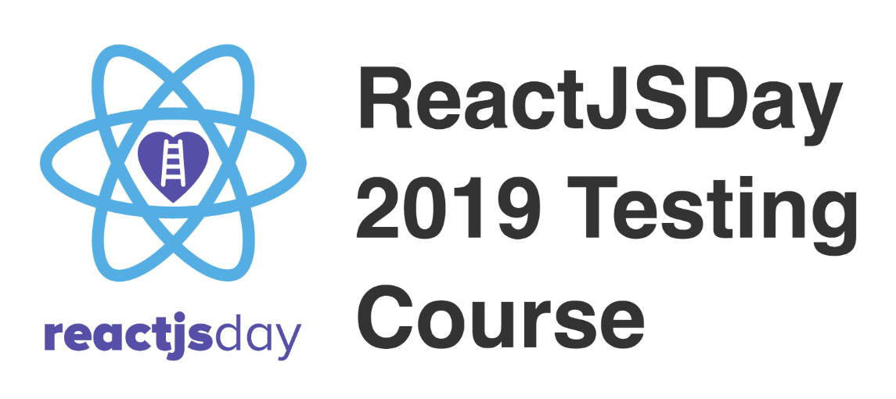

A list of all my contributions ❤️

- [Instructor](#instructor)
- [Speaker](#speaker)
- [UI Testing Best Practices](#ui-testing-best-practices)
- [Plugins](#plugins)
  - [For Cypress](#for-cypress)
  - [For Gatsby](#for-gatsby)
  - [For VS Code](#for-vs-code)
- [Other utilities](#other-utilities)
- [Others](#others)
- [PRs](#prs)
- [Useful Gists](#useful-gists)
- [Answering on StackOverflow](#answering-on-stackoverflow)
- [Articles](#articles)
- [Social links](#social-links)

## Instructor

**React Testing 101: component, integration, and end-to-end testing** @ ReactJSDay ([Course description](https://2019.reactjsday.it/workshops/react-testing-101.html) - [Conference](https://2019.reactjsday.it/))

**Front-end Testing week** @ Talent Garden's CodeMaster 2019 (w/ [Giacomo Zinetti](https://github.com/gcmznt) - [Course website](https://talentgarden.org/it/innovation-school/corsi/full-time/codemaster/))

**E2E Testing with Puppeteer** @ Frontenders Ticino ([Slides](https://slides.com/noriste/e2e-testing-workshop-feti) -
[Meetup](https://www.meetup.com/it-IT/FrontEnders-Ticino/events/258183736/) - [Repository](https://github.com/NoriSte/feti-workshop-e2e-testing-with-puppeteer) -
[FETI](http://www.frontenders.ch))

## Speaker

**Front-end testing on steroids**

- Mar, 2020 - London's CityJSConf ([Conference](https://cityjsconf.org/home))

**Breaking the fear of front-end testing**

- Feb, 2020 - Milano Frontend ([Slides](https://slides.com/noriste/breaking-the-fear-of-front-end-testing) -
  [Meetup](https://www.meetup.com/it-IT/milano-front-end/events/268795702/) - [Milano Frontend](https://www.meetup.com/it-IT/milano-front-end/))

- Feb, 2020 - Como Front End ([Slides](https://slides.com/noriste/breaking-the-fear-of-front-end-testing) -
  [Meetup](https://www.meetup.com/it-IT/Como-CaFE/events/266806426/) - [Cafe](https://www.meetup.com/it-IT/Como-and-Frontend-CaFE/) - [Recording (in Italian)](https://www.youtube.com/watch?v=aDqylR2fNJ4&feature=emb_title))

- Nov, 2019 - JavaScript Community Day ([Slides](https://slides.com/noriste/breaking-the-fear-of-front-end-testing-20m) - [Event](https://www.eventbrite.it/e/biglietti-javascript-community-day-73099501577#) - [Javascript - developer Italiani](https://www.facebook.com/groups/javascript.developer.italiani/))

- Nov, 2019 - Uqido ([Slides](https://slides.com/noriste/breaking-the-fear-of-front-end-testing) - [Event](https://www.eventbrite.it/e/biglietti-breaking-the-fear-of-front-end-testing-uqido-talks-about-79136099203#) - [Uqido](https://www.uqido.com) - [Article and recording (in Italian)](https://tech.uqido.com/2019/11/21/breaking-the-fear-of-front-end-testing-uqido-talks-about/))

**Mastering UI Testing**

- Oct, 2019 - Voxxed Days Ticino ([Slides](https://slides.com/noriste/voxxed-days-ticino-2019-mastering-ui-testing#/) -
  [Conference](https://voxxeddays.com/ticino/) - [Recording](https://www.youtube.com/watch?v=RwWz4hllDtg&list=PLRsbF2sD7JVorYibvQrrG34UQ6YE3PaVP))

* Jul, 2019 - Working Software conference ([Slides](https://slides.com/noriste/working-software-2019-mastering-ui-testing) -
  [Conference](https://www.agilemovement.it/workingsoftware/) - [Companion repository](https://github.com/NoriSte/working-software-mastering-ui-testing) - [Recording](https://vimeo.com/352893293))

**UI Testing
Best Practices**

- Jun, 2019 - FEVR ([Slides](https://slides.com/noriste/fevr-ui-testing-best-practices) -
  [Meetup](http://www.fevr.it/eventi/2019/06/ui-testing-best-practices/) - [Recording (Italian)](https://www.facebook.com/matteoguidotto/videos/10219953432210058) - [FEVR](http://www.fevr.it))

- May, 2019 - Milano Frontend ([Slides](https://slides.com/noriste/milano-frontend-ui-testing-best-practices#/) -
  [Meetup](https://www.meetup.com/it-IT/milano-front-end/events/256620617/) - [Recording (Italian)](https://www.facebook.com/milanofrontendmeetup/videos/2312725798938924/) - [Milano Frontend](https://www.meetup.com/it-IT/milano-front-end/))

**E2E Testing with Jest and Puppeteer**

- Feb, 2019 - Como Front End ([Slides](https://slides.com/noriste/e2e-testing-workshop-cafe#/) -
  [Meetup](https://www.meetup.com/it-IT/Como-and-Frontend-CaFE/events/259556783/) - [Cafe](https://www.meetup.com/it-IT/Como-and-Frontend-CaFE/))

- Jan, 2019 - PugMI ([Slides](https://slides.com/noriste/e2e-testing-talk-grusp#/) -
  [Meetup](https://www.meetup.com/it-IT/MilanoPHP/events/256407565/) - [post](https://milano.grusp.org/2018/12/e2e-testing-con-jest-e-puppeteer/) - [pugMI](https://milano.grusp.org))

## UI Testing Best Practices 

In my spare time, I'm working on a big GitHub repository/book aiming to share my knowledge about UI/E2E Testing and creating a starting point for every browser testing lover.
Take a look at the [UI Testing Best Practices](https://github.com/NoriSte/ui-testing-best-practices) repository. Do you want to contribute? You're more than welcome! 🤗

## Articles

**Some UI testing problems and the Cypress way** - Why is testing a web application so hard? Why generic browser automation tools do not fit well the UI/E2E testing needs? Why does Cypress outstand? ([Medium](https://medium.com/@NoriSte/some-ui-testing-problems-and-the-cypress-way-22312ab986e3) - [dev.to](https://dev.to/noriste/some-ui-testing-problems-and-the-cypress-way-1167))

**Software tests as a documentation tool** - Why tests are perfect to tell a story of your code. ([Medium](https://medium.com/@NoriSte/software-tests-as-a-documentation-tool-e1c463bad1be) - [dev.to](https://dev.to/noriste/software-tests-as-a-documentation-tool-36pl) - [LinkedIn](https://www.linkedin.com/pulse/software-tests-documentation-tool-stefano-magni))

**Launching “\$ npm run” programmatically with `npm.run()`** - No need for child_process.exec() etc. Pre and post scripts are respected too. ([Medium](https://medium.com/@NoriSte/launching-npm-run-programmatically-with-npm-run-f2a1b8a569a6) - [dev.to](https://dev.to/noriste/launching-npm-run-programmatically-with-npm-run-3mmc) - [LinkedIn](https://www.linkedin.com/pulse/launching-npm-run-programmatically-npmrun-stefano-magni))

**New to front-end testing? Start from the top of the pyramid!** - An easier approach to get immediate results (and satisfaction) from the front-end testing world. ([Medium](https://medium.com/@NoriSte/new-to-front-end-testing-start-from-the-top-of-the-pyramid-a0039615353c) - [dev.to](https://dev.to/noriste/new-to-front-end-testing-start-from-the-top-of-the-pyramid-36kj) - [LinkedIn](https://www.linkedin.com/pulse/new-front-end-testing-start-from-top-thepyramid-stefano-magni) - [Cypress blog](https://www.cypress.io/blog/2019/10/10/guest-post-new-to-front-end-testing-start-from-the-top-of-the-pyramid/))

**Who watches the watchmen? Mutation testing in action** - Test effectiveness measurement ([Medium](https://medium.com/@NoriSte/who-watches-the-watchmen-mutation-testing-in-action-4c56e014631) - [dev.to](https://dev.to/noriste/who-watches-the-watchmen-mutation-testing-in-action-3889) - [LinkedIn](https://www.linkedin.com/pulse/who-watches-watchmen-mutation-testing-action-stefano-magni))

**Front-end productivity boost: Cypress as your main development browser** - Productivity, productivity, and productivity: how you should leverage a testing tool like Cypress as your main development browser ([Medium](https://medium.com/@NoriSte/front-end-productivity-boost-cypress-as-your-main-development-browser-f08721123498) - [dev.to](https://dev.to/noriste/front-end-productivity-boost-cypress-as-your-main-development-browser-5cdk) - [LinkedIn](https://www.linkedin.com/pulse/front-end-productivity-boost-cypress-your-main-browser-stefano-magni/))

**The concept of “Monitoring Tests”** - Small E2E tests that check little (but crucial) technical details ([Medium](https://medium.com/@NoriSte/the-concept-of-monitoring-tests-d7cb5af514e5) - [dev.to](https://dev.to/noriste/the-concept-of-monitoring-tests-4l5j) - [LinkedIn](https://www.linkedin.com/pulse/concept-monitoring-tests-stefano-magni/))

**Component vs (UI) Integration vs E2E tests** - UI tests classification ([Medium](https://medium.com/@NoriSte/component-vs-ui-integration-vs-e2e-tests-f02b575339dc) - [dev.to](https://dev.to/noriste/component-vs-ui-integration-vs-e2e-tests-3i0d) - [LinkedIn](https://www.linkedin.com/pulse/component-vs-ui-integration-e2e-tests-stefano-magni/))

**Await, do not make your E2E tests sleep** - Sleeping: the worst practice in E2E testing and the concept of Deterministic Events ([Medium](https://medium.com/@NoriSte/await-do-not-sleep-your-e2e-tests-df67e051b409) - [dev.to](https://dev.to/noriste/await-do-not-make-your-e2e-tests-sleep-4g1o) - [LinkedIn](https://www.linkedin.com/pulse/await-do-make-your-e2e-tests-sleep-stefano-magni/) - [Cypress Blog](https://www.cypress.io/blog/2019/08/21/guest-post-await-do-not-make-your-e2e-tests-sleep/))

**React Hooks Memorandum** ([Medium](https://medium.com/@NoriSte/react-hooks-memorandum-bf1c2758a672))

## Plugins

### For Cypress

**Cypress Wait Until**:
Allows to recursively wait until something happens, proudly made during an [Open Source
Saturday](https://www.meetup.com/it-IT/Open-Source-Saturday-Milano/)
([NPM](https://www.npmjs.com/package/cypress-wait-until) -
[GitHub](https://github.com/NoriSte/cypress-wait-until)) 
 

 

**Cypress Protobuf**
Encodes a Cypress fixture with Protocol Buffers ([NPM](https://www.npmjs.com/package/cypress-protobuf) - [GitHub](https://github.com/NoriSte/cypress-protobuf))
 

**Cypress OTP**: Allows to enter a valid OTP token in your UI tests
([NPM](https://www.npmjs.com/package/cypress-otp) -
[GitHub](https://github.com/NoriSte/cypress-otp))
 

 

### For Gatsby

**Gatsby Perfume.js**:
Embeds [Perfume.js](https://github.com/zizzamia/perfume.js) in a Gatsby website
([NPM](https://www.npmjs.com/package/gatsby-plugin-perfume.js) -
[GitHub](https://github.com/NoriSte/gatsby-plugin-perfume.js) - [Gatsby](https://www.gatsbyjs.org/packages/gatsby-plugin-perfume.js/))
 

**Gatsby Iubenda Cookie Footer**:
Adds the Iubenda's cookie policy banner to a Gatsby website ([NPM](https://www.npmjs.com/package/gatsby-plugin-iubenda-cookie-footer) -
[GitHub](https://github.com/NoriSte/gatsby-plugin-iubenda-cookie-footer) - [Gatsby](https://www.gatsbyjs.org/packages/gatsby-plugin-iubenda-cookie-footer/))
 

 

**Gatsby Preconnect**:
Add a `<link rel="preconnect">` for every specified domain
([NPM](https://www.npmjs.com/package/gatsby-plugin-preconnect) -
[GitHub](https://github.com/NoriSte/gatsby-plugin-preconnect) - [Gatsby](https://www.gatsbyjs.org/packages/gatsby-plugin-preconnect/))
 

 

**Gatsby Preload Link Crossorigin**:
Adds the crossorigin attribute to every `<link rel="preload">`
([NPM](https://www.npmjs.com/package/gatsby-plugin-preload-link-crossorigin) -
[GitHub](https://github.com/NoriSte/gatsby-plugin-preload-link-crossorigin) - [Gatsby](https://www.gatsbyjs.org/packages/gatsby-plugin-preload-link-crossorigin/))
 

### For VS Code

**Increase by 1**: replaces a series of selection with a sequence of numbers ([VS Code
marketplace](https://marketplace.visualstudio.com/items?itemName=noriste.increase-by-1) -
[GitHub](https://github.com/NoriSte/increase-by-1))

## Other utilities

**nprr**: npm run + autocomplete 🚀 ([NPM](https://www.npmjs.com/package/nprr) - [GitHub](https://github.com/NoriSte/nprr))
 
   
     

**URL Content Changes Checker**: A Node.js script to read and visually compare a remote resource
body ([NPM](https://www.npmjs.com/package/url-content-changes-checker) - [GitHub](https://github.com/NoriSte/url-content-changes-checker))
 

**Bitcoin Address Soft Regex Validation**: A single-function package to perform soft (no checksum)
bitcoin address (Base58 and Bech32) validation
([NPM](https://www.npmjs.com/package/bitcoin-address-soft-regex-validation) -
[GitHub](https://github.com/NoriSte/bitcoin-address-soft-regex-validation))
 

**Typescript Is Type**: A Typescript-safe runtime type check function
([NPM](https://www.npmjs.com/package/typescript-is-type) -
[GitHub](https://github.com/NoriSte/typescript-is-type))
 

## Others

**React Crypto Compare**: A simple cryptocurrencies converter component based on https://min-api.cryptocompare.com
([NPM](https://www.npmjs.com/package/react-crypto-compare) -
[GitHub](https://github.com/NoriSte/react-crypto-compare))
 

 

**Cypress React Devtools**: A working React+Redux app to easily (but MANUALLY) verify if the React devtools are working with the Cypress-controlled browser.
([GitHub](https://github.com/NoriSte/cypress-react-devtools))
 

**gitbook-plugin-head-append**: A GitBook plugin to append code to the `<head>` of the GitBook pages.  ([GitHub](https://github.com/noriste/gitbook-plugin-head-append) - [NPM](https://www.npmjs.com/package/gitbook-plugin-head-append))

**WhatsApp Messages Batch**: An easy way to write WhatsApp messages in advance and batch 'em all
([GitHub](https://github.com/NoriSte/whatsapp-messages-batch))

## PRs

**Applitools Eyes Storybook**: Fix storybook 5 support ([GitHub](https://github.com/applitools/eyes-storybook/pull/23))

**Cypress Testing Library**: Cypress commands return jQuery objects ([GitHub](https://github.com/testing-library/cypress-testing-library/pull/62))

**Cypress**: Fix the cy.stub TypeScript signature ([GitHub](https://github.com/cypress-io/cypress/pull/4302))

**Gatsby Brotli and Zopfli plugins**: Allow placing the files in a dedicated directory ([GitHub
Brotli](https://github.com/ovhemert/gatsby-plugin-brotli/pull/6) - [GitHub Zopfli](https://github.com/ovhemert/gatsby-plugin-zopfli/pull/8))

**Cypress Skip and Only UI**: Add support to modules ([GitHub](https://github.com/bahmutov/cypress-skip-and-only-ui/pull/50))

**Percy Cypress**: Add TypeScript types ([GitHub](https://github.com/percy/percy-cypress/pull/96))

**Reveal.js (and slides.com too, obviously) on touch devices**: Remove the thin area between the
down arrow and the progress bar ([GitHub](https://github.com/hakimel/reveal.js/pull/2410) - [Open
Source Saturday](https://www.meetup.com/it-IT/Open-Source-Saturday-Milano/)) 

**Gatsby GTM plugin**: Allow placing the GTM script at the end of the tag
([GitHub](https://github.com/gatsbyjs/gatsby/pull/13424))

**Jest Mock Console**: Using it for log analysis instead of log suppressing ([GitHub](https://github.com/bpedersen/jest-mock-console/pull/6))

## Useful Gists

**NPM as a project dependency**: running `npm run` from a JavaScript file importing NPM ([Gist](https://gist.github.com/NoriSte/0900e44b1a5e7854eb2f1c254eb26763))
 
**TypeScript and React PropTypes**: useful resources ([Gist](https://gist.github.com/NoriSte/c478bbcad9a83e7854d3748606c9f848))
 
**Redux Saga TypeScript typeguard**: implementing typeguard for Axios AJAX requests ([Gist](https://gist.github.com/NoriSte/936096262be7af6b6bd4cba7a71640d9))
 
**Listing package.json scripts** ([Gist](https://gist.github.com/NoriSte/c9edb4e56dce4a609b1df3265fbb13af))
 
**Git diff to archive** ([Gist](https://gist.github.com/NoriSte/a5de5b24893879995e44b7a69d443f08))

## Answering on StackOverflow

**Black box testing Redux Saga**: My Redux Saga testing proposal ([StackOverflow](https://stackoverflow.com/questions/55734309/im-struggling-to-test-this-redux-saga/56017095#56017095))

**React Hooks**: Why should I prefer to use hooks and not use a class-based component instead, what is the benefit of doing so? ([StackOverflow](https://stackoverflow.com/questions/54741142/converting-my-class-based-component-into-functional-components-using-hooks/54741742#54741742))

**Cypress Mousemove issue**: The simplest code to show a strange mouse-related Cypress behaviour ([GitHub](https://github.com/NoriSte/cypress-mousemove-issue))

**Redux Saga Login tests**: The Redux Saga documentation example... tested
([GitHub](https://github.com/NoriSte/redux-saga-login-react-example))

## Social links

You can view them running `$ npx noriste` too 😁

[Twitter](https://twitter.com/NoriSte) -
[LinkedIn](https://www.linkedin.com/in/noriste/) -
[StackOverflow](https://stackoverflow.com/users/700707/noriste) -
[Medium](https://medium.com/@NoriSte) -
[Dev.to](https://dev.to/noriste) -
[NPM](https://www.npmjs.com/settings/noriste/packages) -
[Slides.com](https://slides.com/noriste) -
[Sourcerer](https://sourcerer.io/noriste)
